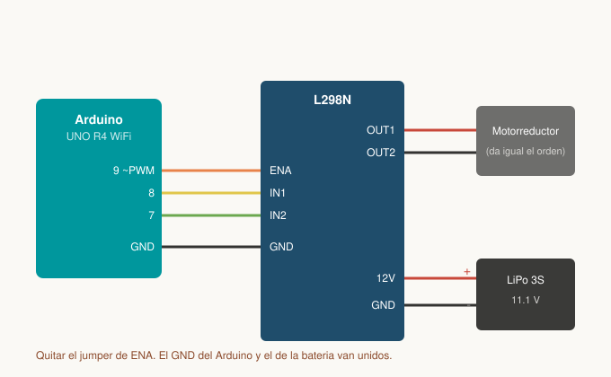
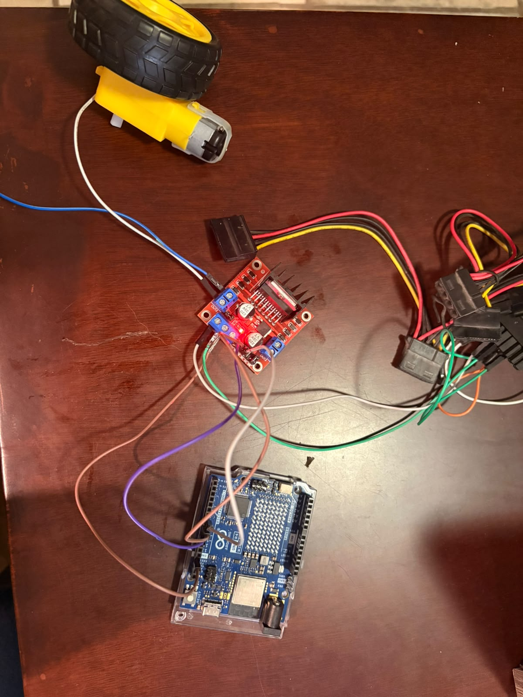

# Nombre del proyecto
Control de velocidad de un motorreductor en 3 niveles por comandos de voz

## Descripción
Una aplicación Android hecha en **MIT App Inventor** reconoce comandos de voz en
español y controla la velocidad de un motorreductor de CD en tres niveles, a través
de un **Arduino UNO R4 WiFi** y un **puente H L298N**.

La app no manda incrementos ("sube", "baja"), sino el **nivel absoluto** que debe
tener el motor (`/vel/0` a `/vel/3`). La cuenta del nivel la lleva la app; el Arduino
solo aplica el PWM que corresponde. Así, si una petición se pierde por la red, la
pantalla del celular y el motor no se desincronizan.

El puente H es necesario porque los pines del Arduino entregan unos 8 mA, muy por
debajo de lo que consume un motorreductor; el L298N actúa como interruptor de potencia
gobernado por señales de baja corriente.

El armado, la conexión a la red y la solución de problemas están en
[Guia-Hardware.md](Guia-Hardware.md).

## Objetivos de aprendizaje
- Variar la velocidad de un motor de CD modulando el ciclo de trabajo de una señal PWM
  aplicada al pin de habilitación (ENA) de un puente H.
- Controlar una carga inductiva de potencia desde un microcontrolador usando un L298N
  con fuente de alimentación independiente y tierra común.
- Calibrar el arranque de un motorreductor: identificar que la fricción de la caja de
  engranes impide el arranque por debajo de cierto PWM, y resolverlo con una patada de
  arranque a plena potencia.
- Diseñar un protocolo HTTP donde el cliente envía estado absoluto en lugar de
  incrementos, para tolerar la pérdida de peticiones.
- Validar rangos en la app (`if nivel < 3` / `if nivel > 0`) para evitar un índice
  fuera de rango en `select list item`.

## Material utilizado
- Arduino UNO R4 WiFi
- Puente H **L298N** (módulo con disipador)
- Motorreductor de CD
- Batería **LiPo 3S (11.1 V)** como fuente de potencia del motor
- Cables dupont macho-hembra
- Teléfono Android con la app **MIT AI2 Companion**
- Red Wi-Fi de 2.4 GHz (o hotspot del celular)

### Conexiones

| L298N | Conecta a | Nota |
|---|---|---|
| ENA | Arduino pin **9** | Entrada PWM. **Quitar el jumper de ENA** |
| IN1 | Arduino pin **8** | Sentido de giro |
| IN2 | Arduino pin **7** | Sentido de giro |
| GND | Arduino **GND** | **Tierra común, obligatoria** |
| +12V | Positivo de la batería LiPo | Fuente de potencia del motor |
| GND | Negativo de la batería | Mismo nodo que el GND del Arduino |
| OUT1 / OUT2 | Terminales del motorreductor | — |

Dos errores que impiden que funcione:

1. **Sin tierra común**, el L298N no tiene referencia para interpretar IN1, IN2 y ENA,
   y el motor no se mueve aunque todo lo demás esté bien.
2. **Con el jumper de ENA puesto**, ese pin queda fijo a 5 V y el módulo ignora la
   señal PWM: el motor gira siempre al máximo.

## Diagrama del circuito

## Código
[ControlMotor.ino](Codigo/ControlMotor.ino)

App móvil (MIT App Inventor): [Codigo/AppInventor](Codigo/AppInventor)

### Rutas HTTP y niveles

| Ruta | Nivel | PWM | Respuesta del Arduino |
|---|---|---|---|
| `/vel/0` | Detenido | 0 | `detenido` |
| `/vel/1` | Baja | 130 | `velocidad baja` |
| `/vel/2` | Media | 190 | `velocidad media` |
| `/vel/3` | Máxima | 255 | `velocidad maxima` |

### Comandos de voz

| Se dice | Efecto |
|---|---|
| "aumentar" | Sube un escalón (tope en 3, avisa si ya está al máximo) |
| "retroceder" | Baja un escalón (piso en 0, avisa si ya está detenido) |
| "alto" | Regresa a nivel 0 de golpe |

### Patada de arranque

El motorreductor no vence la fricción de su caja de engranes por debajo de un PWM de
aproximadamente 200. Si se le aplicara directamente el PWM 130 del nivel 1, el motor
solo zumbaría sin girar.

La solución en `aplicarVelocidad()` es dar **255 durante 150 ms** (`ARRANQUE_MS`) y
después bajar al valor real del nivel. Una vez girando, la inercia y la menor fricción
dinámica permiten sostener el giro con un PWM más bajo, lo que hace que las tres
velocidades se distingan entre sí.

## Video del funcionamiento

[Readme](Video/Readme.txt)

<!-- PENDIENTE: pegar el enlace cuando el video esté subido -->
[Ver video en YouTube]()

## Evidencias de armado

<!-- PENDIENTE: falta la foto del circuito armado (Arduino + L298N + motor + batería) -->

## Reporte
[Reporte de la practica.pdf](Reporte/Reporte%20de%20la%20practica.pdf)

Incluye:
- Tabla de los tres niveles: PWM aplicado contra velocidad observada
- Capturas del Monitor Serie mostrando nivel y PWM en cada comando
- Observaciones sobre el comportamiento del sistema

## Conclusiones

<!-- PENDIENTE: redactar. Puntos que conviene tocar, salidos de la práctica real: -->
<!--                                                                              -->
<!-- - El PWM no controla voltaje sino tiempo encendido; el motorreductor no       -->
<!--   arranca por debajo de ~200 por la fricción de la caja de engranes, pero sí  -->
<!--   se sostiene girando con valores más bajos. De ahí la patada de arranque.    -->
<!-- - Por qué mandar el nivel absoluto y no incrementos: tolera peticiones        -->
<!--   perdidas sin que la pantalla y el motor se desincronicen.                   -->
<!-- - La tierra común y el jumper del ENA: dos fallas que no dan ningún error     -->
<!--   visible, solo un motor que no responde o que gira siempre al máximo.        -->
<!-- - La fuente del motor debe ser independiente: alimentarlo desde el Arduino    -->
<!--   provoca que la placa se reinicie al arrancar por la caída de tensión.       -->

## Resultados
[Resultados.pdf](Resultados/Resultados.pdf)

Este documento contiene la descripción de la práctica, objetivos y procedimientos realizados.

- Reporte técnico estilo IEEE (PDF)
- Tabla PWM contra velocidad de los tres niveles
- Capturas del Monitor Serie
