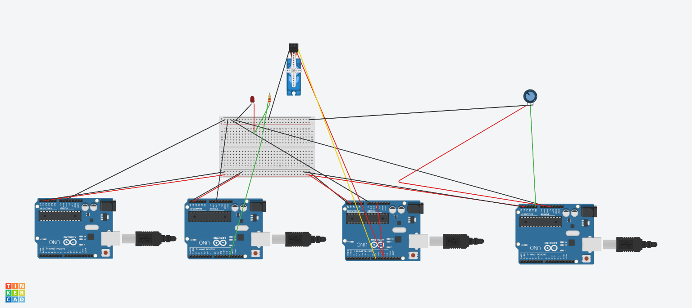

# Nombre del proyecto
Comunicación I2C entre 4 Arduinos

## Descripción
Un Arduino maestro se comunica por el bus I2C (líneas SDA/SCL, tierra común)
con tres Arduinos esclavos, cada uno con su propia dirección (0x08, 0x09,
0x0A): el esclavo 1 prende/apaga un LED por orden del maestro, el esclavo 2
mueve un servomotor al ángulo que el maestro le manda, y el esclavo 3 lee un
potenciómetro y se lo entrega al maestro cuando este lo pide. Simulado en
Tinkercad con 4× Arduino UNO R4 WiFi.

## Objetivos
- Comprender el funcionamiento del bus I2C entre un maestro y varios esclavos.
- Asignar direcciones distintas a cada esclavo y comunicarse con la correcta.
- Programar el envío (`Wire.write`) y la recepción (`Wire.onReceive`/`onRequest`)
  de datos entre placas.
- Detectar cuándo un esclavo no responde en vez de que el programa se cuelgue.

## Herramientas y material utilizado
- 4× Arduino UNO R4 WiFi (simulados en Tinkercad)
- 1 protoboard, 1 LED + resistencia de 470 Ω, 1 micro servo, 1 potenciómetro
- Librerías `Wire` y `Servo` (incluidas en el entorno de Arduino, `Servo` se
  instala aparte para el core de la R4)
- Tinkercad y Monitor Serie

## Diagrama
Las cuatro placas comparten SDA (A4), SCL (A5) y tierra (GND); el maestro es
la que se alimenta por USB. En físico (fuera del simulador) esas líneas
necesitan pull-up de 4.7 kΩ a 5V, porque la R4 no las trae integradas.

## Código
Cuatro programas independientes: el maestro consulta al esclavo del
potenciómetro cada 500 ms sin bloquear (`millis()`), reenvía el ángulo al
esclavo del servo y atiende el Monitor Serie para prender/apagar el LED del
esclavo 1. Ajustado para la UNO R4 WiFi (ver nota de compilación en
[Codigo/Readme.txt](Codigo/Readme.txt)).

[Ver código](Codigo/)

## Reporte
El reporte contiene la metodología del bus I2C, los ajustes hechos para la
R4 WiFi, el diagrama de conexión y las conclusiones técnicas.

[Ver Reporte](Reporte/Reporte-Comunicacion-I2C.pdf)

## Resultados
Diseño verificado por compilación (los 4 programas compilan para
`arduino:renesas_uno:unor4wifi`) y por lectura del código: el maestro debe
reportar el valor del potenciómetro y el ángulo enviado cada 500 ms, mover el
servo en tiempo real y prender/apagar el LED al escribir 1/0. Falta corroborar
esto corriendo la simulación completa en Tinkercad (capturas pendientes, ver
[Terminal/Readme.txt](Terminal/Readme.txt)).

## Video
[Ver video](https://youtu.be/-maYry-BLSA) · [Ver carpeta Video](Video/)

## Conclusiones
El bus I2C comunica varios dispositivos con solo dos líneas (SDA y SCL) más
tierra común: agregar un esclavo no pide pines nuevos, solo una dirección
distinta, y quien controla la conversación es siempre el maestro.

Revisar el resultado de `endTransmission()` y de `requestFrom()` es lo que
distingue un fallo detectado (esclavo desconectado, reportado por su nombre)
de un programa que se queda esperando una respuesta que nunca llega — la
misma lógica de "no confiar en que siempre funciona" que ya se usó con
`millis()` en la Práctica 2.

Dos errores quedaron documentados como los más comunes al armar este bus: una
resistencia con las dos patas en la misma columna de la protoboard no protege
nada (los huecos de una columna están unidos por dentro) y puede quemar el
LED; y leer el mismo dato de I2C dos veces dentro de la misma expresión
devuelve basura en la segunda lectura, porque el byte ya se consumió en la
primera.
